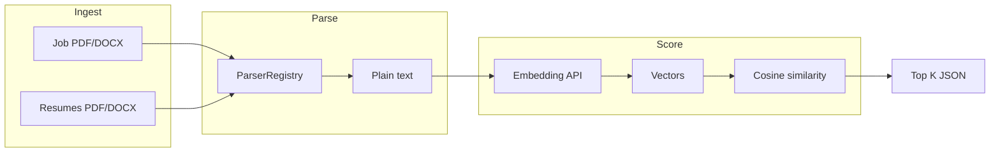

# Talent Intelligence & Ranking Engine — Architecture

This document describes the proof-of-concept (POC) implementation, how it satisfies the stated technical constraints, and what a production system would look like.

---

## Technical constraints — compliance

| # | Constraint | Status | Where it is met |
| --- | --- | --- | --- |
| **1** | **File format handling:** ingest at least **PDF** and **DOCX**; parsing **extensible** to new formats without a full rewrite. | **Met** | **PDF:** `backend/app/parsers/pdf_parser.py` (PyMuPDF). **DOCX:** `backend/app/parsers/docx_parser.py` (`python-docx` + OOXML ZIP/XML fallback). **Extensibility:** abstract `DocumentParser` + `ParserRegistry` in `backend/app/parsers/base.py`; add a class, implement `supports()` / `parse()`, register in `default_registry()` — **`POST /match` and callers stay unchanged.** Optional byte sniffing: `backend/app/parsers/sniff.py`. |
| **2** | **Data pipeline:** **raw document intake → parsing → scoring → ranked output**; design suitable for production even if the POC is not production-grade. | **Met** | **Implemented** in `backend/app/api/routes/match.py` + `backend/app/services/matching_pipeline.py`. Stages below. **Production-scale** options are in [Production-scale design](#production-scale-design) and the [data-flow diagram](#data-flow). |
| **3** | **Cold start accuracy:** handle a **brand-new job posting** with **no historical data** or prior match signals — approach must be **reasoned and defensible**, not “we will add this later” as the only answer. | **Met** | **Primary strategy (implemented, not deferred):** general-purpose **text embeddings** + **cosine similarity** between JD and each resume. Pretrained models encode semantics without needing labels for *this* role. See [Cold start accuracy](#cold-start-accuracy) and the `cold_start_note` field in the `POST /match` JSON response. |

---

## Repository layout (scaling)

### Backend (`backend/app/`)

| Path | Purpose |
| --- | --- |
| **`main.py`** | Create FastAPI app, CORS, **register routers** only — keep this file small. |
| **`core/`** | Settings and env (`config.py`). Add shared constants or security helpers here later. |
| **`api/deps.py`** | `Depends()` providers (parsers, embedders). Wire new services once, inject everywhere. |
| **`api/helpers.py`** | HTTP/multipart helpers (not business rules). |
| **`api/routes/`** | One module per route group (`health.py`, `match.py`). **New REST resources** → new file + `app.include_router(...)`. |
| **`models/`** | Pydantic response/request models. Split by domain when it grows. |
| **`parsers/`** | Pluggable formats (`DocumentParser` + `ParserRegistry`). |
| **`services/`** | Embeddings, ranking, **`matching_pipeline.py`** (orchestration). Add rerankers, queues, or caching here without touching routes. |

### Frontend (`frontend/src/`)

| Path | Purpose |
| --- | --- |
| **`main.tsx`** | React bootstrap. |
| **`app/`** | Top-level screen(s): `App.tsx`, co-located CSS. |
| **`lib/`** | Pure utilities: API URL, constants, redaction (no JSX). |
| **`types/`** | TypeScript types aligned with the API. |
| **`components/`** | Shared UI pieces (empty placeholder for now). |
| **`features/`** | Optional feature folders as routes/screens multiply. |

---

## End-to-end pipeline (Constraint 2 — implemented)

This is the exact logical flow implemented in code (`POST /match`):

1. **Raw document intake** — Multipart upload: one job-description file + one or more resume files (`api/routes/match.py`).
2. **Parsing** — Bytes → `ParserRegistry` → format-specific `DocumentParser` → normalized `ParsedDocument` (plain text + metadata). Job and resumes use the **same** parsers and registry.
3. **Scoring** — Text is **embedded** with OpenAI (`text-embedding-3-small` by default); **scores** are **cosine similarities** between the job-description vector and each resume vector (`app/services/embeddings.py`, `app/services/ranking.py`). This *is* the scoring stage (learned representation + geometric similarity), not a placeholder.
4. **Ranked output** — Sort by score descending; return **top K** (default 10) with rank, label, score, format (upload), excerpt (`MatchResponse`).

The pipeline does **not** rely on any prior applicants, A/B tests, or click data for that job — see [Cold start accuracy](#cold-start-accuracy).

---

## Cold start accuracy (Constraint 3)

**Problem:** A new job requisition has **no** internal history (no past hires for this exact role, no “good match” labels, no click-through on this posting).

**Approach (defensible and implemented):**

1. **Pretrained embeddings** — The embedding model is trained on large-scale general text (not on your company’s private ATS). It maps JD text and resume text into a shared vector space where **semantic similarity** (skills, responsibilities, domain language) correlates with proximity of vectors.
2. **No training data required for this job** — For a cold posting, we still produce a **total ordering** of candidates by **similarity of full-document text** to the JD. That is a standard, interpretable retrieval signal: “who looks most like this role on paper?”
3. **Why this is not a deferral** — The system **does** answer cold start: the answer is “semantic nearest neighbors in embedding space,” not “we cannot rank until we collect data.” Historical data would **refine** (calibrate, debias, re-rank) but is **not** a prerequisite for a first-pass shortlist.

**Limitations (honest, not a substitute for the above):**

- Similarity favors **lexical and topical overlap**; it does not know your bar for culture, compensation, or unwritten requirements.
- **Structured** constraints (must-have licenses, years in role) are not enforced unless extracted explicitly (future enhancement).
- **Fairness:** pretrained models can reflect biases present in web-scale training data; monitoring and policy matter in production.

Optional improvements (e.g. cross-encoder reranking, learned-to-rank from *future* outcomes) **add** to this baseline; they do not replace the cold-start mechanism above.

---

## System design (POC)

| Layer | Responsibility |
| --- | --- |
| **Web UI** | React + Vite: upload job description (PDF/DOCX) and multiple resumes; display top 10 ranked candidates with scores and excerpts. |
| **API** | FastAPI: multipart intake, orchestration, error handling, CORS for local dev. |
| **Parsing** | Pluggable `DocumentParser` implementations registered in `ParserRegistry` (PDF via PyMuPDF, DOCX via `python-docx` + OOXML fallback). |
| **Scoring** | OpenAI `text-embedding-3-small`: one embedding for the full JD text and one per resume; cosine similarity ranks candidates. `TOP_K` (default 10) caps output size. |

## Data flow

1. **Intake**: HTTP multipart files arrive at `POST /match`.
2. **Parse**: Bytes → format-specific parser → normalized `ParsedDocument` (text + label + internal `format_id`).
3. **Embed**: Batch request: `[jd_text, resume_1, …, resume_n]` → embedding vectors.
4. **Score / rank**: Cosine similarity between each resume vector and the JD vector; sort descending; take top K.
5. **Respond**: JSON with ranks, scores, short excerpts, upload format for display, and `cold_start_note`.

## Production-scale design

| Concern | POC | Production direction |
| --- | --- | --- |
| **Storage** | Ephemeral (in-memory bytes). | **S3** (or GCS/Azure Blob) for originals; **metadata DB** (PostgreSQL) for job IDs, candidate IDs, parse status, embedding version, audit. |
| **Ingestion** | Synchronous upload. | **API** accepts upload → writes to object storage → emits **event** (SNS/SQS, Kafka, RabbitMQ). |
| **Parsing** | Inline in request. | **Queue workers** (Celery, Bull, AWS Lambda + SQS) pull jobs; idempotent retries; dead-letter queue for poison files. |
| **Embeddings** | Single batch call per request. | Chunk long documents; cache embeddings keyed by content hash + model version; rate limiting and backoff; optional **regional** OpenAI or **self-hosted** models. |
| **Ranking** | Cosine only. | **Two-stage**: cheap retrieval (ANN index: Pinecone, OpenSearch k-NN, pgvector) → **cross-encoder / LLM rerank** for top-N; blend with structured signals (years of experience, licenses) from extracted fields. |
| **Serving** | Single process. | Horizontally scaled API behind a load balancer; **read replicas** for ranking queries; **feature flags** for model versions. |
| **Security** | Local dev CORS. | AuthN/Z (OIDC), per-tenant isolation, PII encryption at rest, virus scanning on upload, retention policies. |

## Known failure modes

| Failure | Effect | Mitigation (design-level) |
| --- | --- | --- |
| **Corrupt or scanned PDF** | Empty or garbage text → parse failure or nonsense embeddings. | OCR pipeline for scans; validation rules (min length, entropy); user-visible errors. |
| **Wrong format / unsupported ext** | Parser not found. | Clear 400 errors; allow list of types; future parsers for HTML/RTF. |
| **OpenAI outage / rate limit** | `502` / timeouts. | Retries with exponential backoff; queue-based async jobs; fallback model or degraded mode message. |
| **Embedding model drift** | Scores not comparable across time if model changes. | Store `embedding_model` version on each run; re-embed when upgrading models. |
| **Semantic false positives** | High similarity for keyword overlap without true fit. | Reranker, structured skill extraction, human-in-the-loop for shortlists. |
| **Bias / fairness** | Pretrained models may encode demographic correlations. | Policy review, monitoring, optional blind screening flows—not solved by embeddings alone. |
| **Company-specific calibration** | Embeddings are not trained on *your* hire/no-hire labels. | Cold start still works via general semantics; over time, **optional** learn-to-rank from outcomes improves calibration—this augments the baseline, not a prerequisite for cold start. |

## Extending formats

Add a new `DocumentParser` subclass implementing `supports()` and `parse()`, register it in `default_registry()` in `backend/app/parsers/base.py`. Callers (`POST /match`) stay unchanged.

## Local run

See root `README.md` for backend (`uvicorn`) and frontend (`npm run dev`) commands and environment variables.
