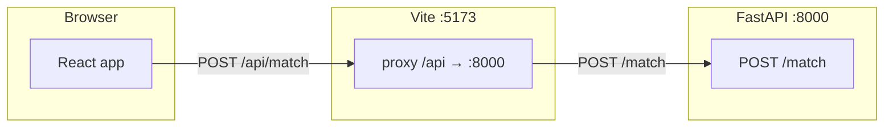

# Talent Intelligence & Ranking Engine (POC)

End-to-end flow: **upload job description + resumes → parse → OpenAI embeddings → cosine similarity → top 10 candidates.** Deeper architecture, constraint checklist, and production scaling are in [DESIGN.md](./DESIGN.md).

**Supported formats (job description and each resume):** **PDF** and **DOCX** (same parsers for all uploads; `.docm` is treated like DOCX when valid OOXML). **Legacy Word `.doc` (binary)** is not supported—open in Word/Google Docs and **Save As `.docx`** or **export PDF**. If a file is named `.docx` but is actually `.doc`, the API will return a clear error (real `.docx` files are zip-based internally; you do not upload a ZIP manually).

---

## How the frontend and backend work together

| Piece | Role |
| --- | --- |
| **Frontend** (`frontend/`) | React + Vite UI: file pickers for the job file + multiple resumes, `fetch` to run matching, table of ranked results. |
| **Backend** (`backend/`) | FastAPI app: receives multipart uploads, parses PDF/DOCX to text, calls OpenAI embeddings, scores with cosine similarity, returns JSON (top K). |

**Local dev request path**

1. You open the UI at **`http://localhost:5173`** (Vite dev server).
2. The UI sends **`POST /api/match`** (same origin) with `FormData`: field `job_description` (one file) and `resumes` (one file per resume, repeated).
3. Vite’s dev **proxy** (`frontend/vite.config.ts`) forwards **`/api/*`** to **`http://127.0.0.1:8000`** and strips the `/api` prefix, so the backend receives **`POST /match`**.
4. The FastAPI handler is `POST /match` in `backend/app/main.py`. It does **not** listen on `/api/match`—the `/api` prefix exists only in the browser during dev.



**Calling the API without the proxy** (e.g. debugging with curl): use **`http://127.0.0.1:8000/match`** directly. To point the SPA at the API without the proxy, set **`VITE_API_BASE=http://127.0.0.1:8000`** in `frontend/.env` — the app then calls **`{base}/match`**, not `/api/match`. See `frontend/.env.example`.

---

## Repository layout (what to open first)

| Path | Purpose |
| --- | --- |
| `frontend/src/App.tsx` | UI: uploads, `fetch`, results table |
| `frontend/vite.config.ts` | Dev proxy `/api` → backend |
| `backend/app/main.py` | FastAPI routes: `GET /health`, `POST /match` (full pipeline) |
| `backend/app/parsers/` | Pluggable PDF/DOCX parsing (`base.py`, `pdf_parser.py`, `docx_parser.py`, `sniff.py`) |
| `backend/app/services/` | Embeddings (`embeddings.py`), cosine ranking (`ranking.py`) |
| `backend/.env` | **`OPENAI_API_KEY`** (create from `.env.example`; never commit) |

---

## Prerequisites

- **Python 3.11+** (3.9+ often works; 3.11+ recommended)
- **Node 20+** (for Vite 8)
- **OpenAI API key** with access to embeddings (`text-embedding-3-small` by default)

---

## Run the app locally (two terminals)

**Terminal 1 — API**

On **Windows**, use `.venv\Scripts\activate` instead of `source .venv/bin/activate`.

First time only:

```bash
cd backend
python3 -m venv .venv
source .venv/bin/activate
pip install -r requirements.txt
cp .env.example .env
```

Edit **`backend/.env`** and set **`OPENAI_API_KEY=`** your key. Then start:

```bash
cd backend
source .venv/bin/activate
uvicorn app.main:app --reload --host 127.0.0.1 --port 8000
```

- **Health:** `GET http://127.0.0.1:8000/health` → `{"status":"ok"}`
- **Match:** `POST http://127.0.0.1:8000/match` — multipart form: `job_description` (file), `resumes` (file, repeat for each resume)

**Terminal 2 — UI**

```bash
cd frontend
npm install
npm run dev
```

Open the printed URL (usually **http://localhost:5173**). Use **Find top matches** after selecting files.

**Security:** Keep secrets only in **`backend/.env`** (gitignored). Do not commit real keys.

---

## Configuration

| Setting | Where | Notes |
| --- | --- | --- |
| `OPENAI_API_KEY` | `backend/.env` | Required for `/match` |
| `EMBEDDING_MODEL`, `TOP_K` | `backend/.env` | Optional; see `backend/.env.example` |
| `VITE_API_BASE` | `frontend/.env` | Optional; omit to use Vite proxy (default) |

---

## API quick reference

| Method | Path | Purpose |
| --- | --- | --- |
| `GET` | `/health` | Liveness check |
| `POST` | `/match` | Multipart: `job_description`, `resumes` (multiple). Returns ranked candidates + `cold_start_note`. |

Interactive docs: **`http://127.0.0.1:8000/docs`** (Swagger) when the backend is running.

---

## Troubleshooting

| Symptom | What to do |
| --- | --- |
| `Missing script: "dev"` | Run commands from **`frontend/`**, not the repo root. |
| `Cannot find module` / no `node_modules` | `cd frontend && npm install` |
| **500** on Find top matches | Backend not on **8000**, or proxy issue. Start uvicorn; check terminal for errors. |
| `OPENAI_API_KEY` / **503** on match | Set the key in **`backend/.env`** and restart uvicorn. |
| `EADDRINUSE` on **5173** | Another app uses the port; stop it or `npx vite --port 5174`. |
| `Address already in use` on **8000** | Stop the old process: `kill $(lsof -t -i:8000)` or change uvicorn port and update `vite.config.ts` proxy `target`. |
| `cp: yet: Not a directory` | Paste **`cp .env.example .env`** as a single line (see [Backend](#run-the-app-locally-two-terminals)). |
| `vite` / ESM errors | Use **Node 20+** (`node -v`). |

---

## Definition of done

- Top **10** ranked candidates for a job (configurable via **`TOP_K`** in backend settings).
- **[DESIGN.md](./DESIGN.md)** — constraints, pipeline, cold start, production scaling, failure modes.
